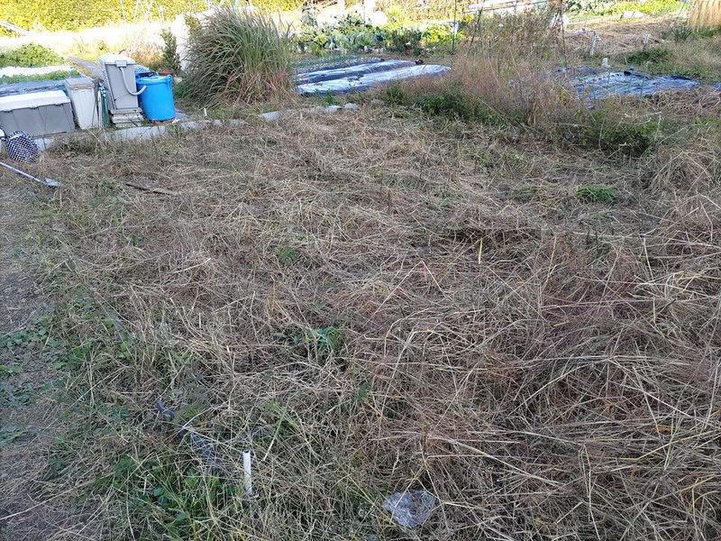
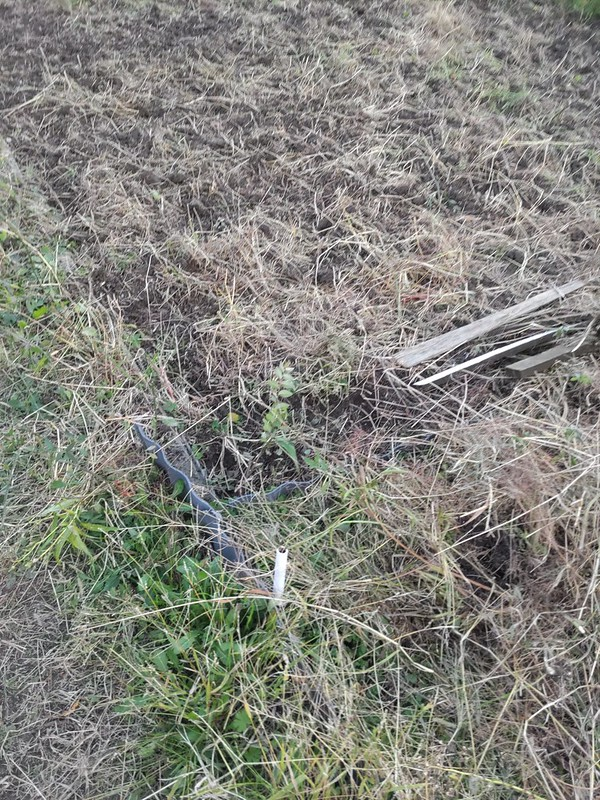

# 新区画を耕す<pre lang='en'>Cultivated the new plot</pre>
新区画を耕してから，雑草を近くの池の土手に捨てて, 石灰をまいて，エン麦の種をまいた。

After I tilled the new plot, I moved the removed weeds out to a bank of the nearby pond. Then I scattered lime powder over the new plot. In the end, I sowed oat seeds there.

<figure markdown>
  { width="600" }
  <figcaption>耕す前<pre lang='en'>Before cultivation</pre></figcaption>
</figure>
<figure markdown>
  
  <figcaption>耕した後<pre lang='en'>After cultivation</pre></figcaption>
</figure>
